# E-Commerce MSA 시스템 아키텍처

## 문서 정보

| 항목 | 내용 |
|------|------|
| **작성일** | 2025-01-04 |
| **버전** | 1.0 |
| **목적** | E-Commerce MSA 전체 시스템 아키텍처 설계 및 구성 요소 정의 |
| **관련 문서** | - `msa-migration-plan.md`<br>- `saga-choreography-pattern.md`<br>- `saga-event-tracker-architecture.md`<br>- `k8s-infrastructure-design.md` |

---

## 목차

1. [시스템 개요](#1-시스템-개요)
2. [High-Level Architecture](#2-high-level-architecture)
3. [API Gateway](#3-api-gateway)
4. [MSA Services](#4-msa-services)
5. [Event Streaming](#5-event-streaming)
6. [데이터 저장소](#6-데이터-저장소)
7. [모니터링 및 관찰성](#7-모니터링-및-관찰성)
8. [인프라 구성](#8-인프라-구성)
9. [보안 아키텍처](#9-보안-아키텍처)
10. [확장성 및 성능](#10-확장성-및-성능)

---

## 1. 시스템 개요

### 1.1 아키텍처 스타일

**Microservices Architecture (MSA)** 기반 E-Commerce 플랫폼

**핵심 원칙**:
- ✅ **서비스 독립성**: 각 마이크로서비스는 독립적으로 개발, 배포, 확장
- ✅ **Domain-Driven Design (DDD)**: 비즈니스 도메인 기반 서비스 분리
- ✅ **Event-Driven Architecture**: Kafka 기반 비동기 통신
- ✅ **Choreography Saga**: 분산 트랜잭션 조율
- ✅ **API-First**: OpenAPI 3.0 기반 API 설계

### 1.2 기술 스택

| 계층 | 기술 | 버전 | 역할 |
|------|------|------|------|
| **API Gateway** | Kubernetes Gateway API + Istio Gateway | 1.0+ / 1.22+ | 라우팅, 인증, Rate Limiting, mTLS |
| **Service Mesh** | Istio | 1.22+ | L4/L7 트래픽 관리, mTLS, Observability |
| **Backend Services** | Spring Boot + Kotlin | 3.x / 2.2.20 | 비즈니스 로직 |
| **Event Streaming** | Kafka (KRaft) | 3.6+ | 이벤트 기반 통신 |
| **Database** | PostgreSQL | 15+ | 각 서비스별 독립 DB |
| **Cache** | Redis | 7.x | Token Blacklist, Rate Limiting, Recommendation Cache |
| **Batch Processing** | Apache Airflow | 2.8+ | 추천 시스템 배치 파이프라인, 통계 집계 |
| **Monitoring** | Prometheus + Grafana | Latest | Metrics & Dashboard |
| **Tracing** | Jaeger + OpenTelemetry | Latest | 분산 추적 |
| **Logging** | Grafana Loki + Alloy | Latest | 중앙 로그 수집 및 시각화 |
| **Container Orchestration** | Kubernetes | 1.28+ | 컨테이너 관리 |

### 1.3 서비스 목록

#### 핵심 비즈니스 서비스

| 서비스 | 도메인 | 주요 책임 | Database |
|--------|--------|----------|----------|
| **User Service** | 사용자 관리 | 회원가입, 로그인, 프로필 관리, Refresh Token 관리 | user_db |
| **Authorization Service** | 권한 관리 | 역할, 권한, 접근 제어 | auth_db |
| **Store Service** | 상점 관리 | 상점 생성, 수정, 출시 | store_db |
| **Product Service** | 상품 관리 | 상품 등록, 재고 관리, 메타데이터 관리 (브랜드, 태그, 속성) | product_db |
| **Order Service** | 주문 관리 | 주문 생성, 취소, 조회 | order_db |
| **Payment Service** | 결제 관리 | 결제 요청, 완료, 환불 | payment_db |
| **Review Service** | 리뷰 관리 | 리뷰 작성, 조회, 평점 | review_db |

#### 지원 서비스

| 서비스 | 도메인 | 주요 책임 | Database |
|--------|--------|----------|----------|
| **Recommendation Service** | 추천 시스템 | 유사 상품 추천, 개인화 추천, 실시간 유사도 계산 | recommendation_db |
| **Analytics Service** | 데이터 분석 | 사용자 행동 데이터 수집, 통계 집계, 이벤트 스트리밍 | analytics_db |
| **Saga Tracker Service** | Saga 추적 | 분산 트랜잭션 모니터링 | saga_db |

---

## 2. High-Level Architecture

### 2.1 시스템 컨텍스트 다이어그램 (C4 Level 1)

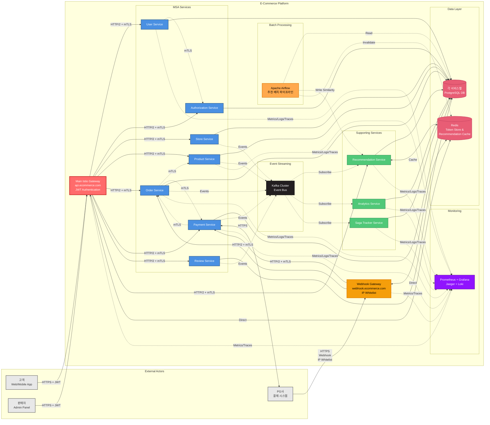

### 2.2 컨테이너 다이어그램 (C4 Level 2)

```mermaid
graph TB
    subgraph "Client Layer"
        WebApp[Web Application<br/>React/Next.js]
        MobileApp[Mobile App<br/>React Native]
        AdminPanel[Admin Panel<br/>Vue.js]
    end

    subgraph "Ingress & Service Mesh Layer"
        IstioGW["Istio Gateway<br/>Kubernetes Gateway API<br/>Port: 443 (HTTPS)"]

        subgraph "Gateway Features"
            Auth_["Authentication<br/>(JWT Validation)"]
            Logging["Access Logging<br/>(Grafana Loki)"]
        end
    end

    subgraph "Application Layer"
        direction TB

        subgraph "Core Services"
            OrderSvc["Order Service<br/>:8081<br/>3 pods"]
            ProductSvc["Product Service<br/>:8082<br/>3 pods"]
            PaymentSvc["Payment Service<br/>:8083<br/>3 pods"]
            StoreSvc["Store Service<br/>:8084<br/>3 pods"]
        end

        subgraph "Supporting Services"
            UserSvc["User Service<br/>:8085<br/>2 pods"]
            AuthSvc["Authorization Service<br/>:8086<br/>2 pods"]
            ReviewSvc["Review Service<br/>:8087<br/>2 pods"]
            SagaSvc["Saga Tracker Service<br/>:8088<br/>3-10 pods (HPA)"]
            RecommendSvc["Recommendation Service<br/>:8089<br/>2 pods<br/>(상품 유사도 추천)"]
            AnalyticsSvc["Analytics Service<br/>:8090<br/>2 pods<br/>(집계 및 분석)"]
        end
    end

    subgraph "Batch Processing Layer"
        Airflow["Apache Airflow<br/>Scheduler + Worker<br/>(상품 유사도 배치 계산)"]
    end

    subgraph "Event Streaming Layer"
        KafkaCluster["Kafka Cluster (KRaft)<br/>3 brokers"]

        subgraph "Topics"
            BizTopics["Business Topics<br/>- order-events<br/>- product-events<br/>- payment-events<br/>- store-events<br/>- review-events"]
            SagaTopic["Saga Topic<br/>- saga-events<br/>(6 partitions)"]
        end
    end

    subgraph "Data Layer"
        OrderDB[(order_db<br/>PostgreSQL)]
        ProductDB[(product_db<br/>PostgreSQL)]
        PaymentDB[(payment_db<br/>PostgreSQL)]
        StoreDB[(store_db<br/>PostgreSQL)]
        UserDB[(user_db<br/>PostgreSQL)]
        AuthDB[(auth_db<br/>PostgreSQL)]
        ReviewDB[(review_db<br/>PostgreSQL)]
        SagaDB[(saga_db<br/>PostgreSQL)]
        RecommendDB[(recommendation_db<br/>PostgreSQL<br/>상품 유사도 저장)]
        AnalyticsDB[(analytics_db<br/>PostgreSQL<br/>집계 데이터 저장)]

        RedisCache[(Redis Cluster<br/>3 nodes<br/>추천 결과 캐싱)]
    end

    subgraph "External Services"
        PGSystem[PG사<br/>결제 시스템]
    end

    WebApp -->|HTTPS| IstioGW
    MobileApp -->|HTTPS| IstioGW
    AdminPanel -->|HTTPS| IstioGW

    IstioGW --> Auth_
    IstioGW --> Logging

    IstioGW -->|HTTP/2 + mTLS| OrderSvc
    IstioGW -->|HTTP/2 + mTLS| ProductSvc
    IstioGW -->|HTTP/2 + mTLS| PaymentSvc
    IstioGW -->|HTTP/2 + mTLS| StoreSvc
    IstioGW -->|HTTP/2 + mTLS| UserSvc
    IstioGW -->|HTTP/2 + mTLS| AuthSvc
    IstioGW -->|HTTP/2 + mTLS| ReviewSvc
    IstioGW -->|HTTP/2 + mTLS| RecommendSvc

    IstioGW <-->|Token Blacklist & Rate Limiting| RedisCache

    OrderSvc --> OrderDB
    ProductSvc --> ProductDB
    PaymentSvc --> PaymentDB
    StoreSvc --> StoreDB
    UserSvc --> UserDB
    AuthSvc --> AuthDB
    ReviewSvc --> ReviewDB
    SagaSvc --> SagaDB
    RecommendSvc --> RecommendDB
    RecommendSvc <-->|캐싱| RedisCache
    AnalyticsSvc --> AnalyticsDB

    OrderSvc -.->|Publish| BizTopics
    ProductSvc -.->|Publish| BizTopics
    PaymentSvc -.->|Publish| BizTopics
    StoreSvc -.->|Publish| BizTopics
    ReviewSvc -.->|Publish| BizTopics

    BizTopics -.->|Subscribe<br/>product-events| RecommendSvc
    BizTopics -.->|Subscribe<br/>All Events| AnalyticsSvc

    Airflow -->|배치 유사도 계산| RecommendDB
    Airflow -.->|Read Product Data| ProductDB

    OrderSvc -.->|Publish| SagaTopic
    ProductSvc -.->|Publish| SagaTopic
    PaymentSvc -.->|Publish| SagaTopic

    BizTopics -->|Subscribe| OrderSvc
    BizTopics -->|Subscribe| ProductSvc
    BizTopics -->|Subscribe| PaymentSvc
    BizTopics -->|Subscribe| ReviewSvc

    SagaTopic -->|Consume| SagaSvc

    PaymentSvc <-->|API Call| PGSystem

    classDef clientStyle fill:#E8E8E8,stroke:#666,stroke-width:2px
    classDef gatewayStyle fill:#FF6B6B,stroke:#C92A2A,stroke-width:3px,color:#fff
    classDef meshStyle fill:#9B59B6,stroke:#6C3483,stroke-width:2px,color:#fff
    classDef serviceStyle fill:#4A90E2,stroke:#2E5C8A,stroke-width:2px,color:#fff
    classDef kafkaStyle fill:#231F20,stroke:#000,stroke-width:2px,color:#fff
    classDef dbStyle fill:#50C878,stroke:#3A9B5C,stroke-width:2px,color:#fff
    classDef externalStyle fill:#FFA94D,stroke:#D97706,stroke-width:2px
    classDef batchStyle fill:#B8860B,stroke:#8B6914,stroke-width:2px,color:#fff

    class WebApp,MobileApp,AdminPanel clientStyle
    class IstioGW,Auth_,Logging gatewayStyle
    class OrderSvc,ProductSvc,PaymentSvc,StoreSvc,UserSvc,AuthSvc,ReviewSvc,SagaSvc,RecommendSvc,AnalyticsSvc serviceStyle
    class KafkaCluster,BizTopics,SagaTopic kafkaStyle
    class OrderDB,ProductDB,PaymentDB,StoreDB,UserDB,AuthDB,ReviewDB,SagaDB,RecommendDB,AnalyticsDB,RedisCache dbStyle
    class PGSystem externalStyle
    class Airflow batchStyle
```

---

## 3. API Gateway & Service Mesh

### 3.1 Istio Gateway 역할

**Kubernetes Gateway API + Istio Gateway** 기반 트래픽 관리

| 책임 | 설명 | 구현 기술 |
|------|------|----------|
| **TLS Termination** | HTTPS 연결 종료 및 인증서 관리 | Istio Gateway + cert-manager |
| **라우팅** | 클라이언트 요청을 적절한 마이크로서비스로 전달 | Kubernetes Gateway API (HTTPRoute) |
| **mTLS** | 서비스 간 자동 암호화 통신 | Istio |
| **인증** | JWT 토큰 검증 및 사용자 인증 | Istio RequestAuthentication + AuthorizationPolicy |
| **인가** | 사용자 역할 기반 접근 제어 | Istio AuthorizationPolicy |
| **Rate Limiting** | 요청 속도 제한 (IP, User별) | Istio EnvoyFilter + Redis |
| **Circuit Breaker** | 장애 전파 방지 및 Fallback | Istio DestinationRule |
| **Retry & Timeout** | 재시도 및 타임아웃 정책 | Istio VirtualService |
| **로깅** | 모든 요청/응답 로그 수집 | Envoy Access Logs → Grafana Loki |
| **Monitoring** | 메트릭 수집 및 분산 추적 | Prometheus + Jaeger (Istio 기본 통합) |

> **Note**: Istio 배포 모드(Sidecar vs Ambient Mesh)는 추후 결정 예정입니다. 대규모 분산 트랜잭션 환경에서의 성능 테스트 후 최종 선택할 예정입니다.

### 3.2 Istio Gateway 상세 구성

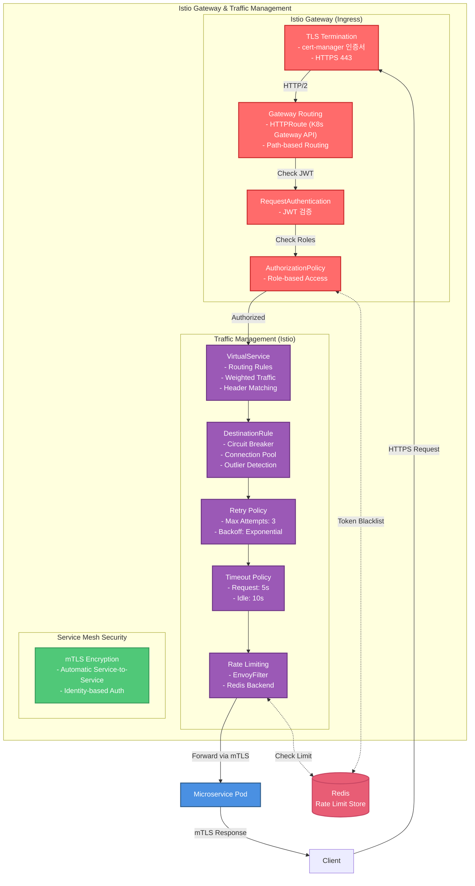

### 3.3 Istio Gateway 및 Traffic Management 설정 예시

#### 3.3.1 Gateway 리소스 (Kubernetes Gateway API)

```yaml
apiVersion: gateway.networking.k8s.io/v1
kind: Gateway
metadata:
  name: ecommerce-gateway
  namespace: ecommerce
spec:
  gatewayClassName: istio
  listeners:
  - name: https
    hostname: "api.ecommerce.com"
    port: 443
    protocol: HTTPS
    tls:
      mode: Terminate
      certificateRefs:
      - name: ecommerce-tls-cert
        kind: Secret
    allowedRoutes:
      namespaces:
        from: Same
```

#### 3.3.2 HTTPRoute 리소스 (라우팅 설정)

```yaml
apiVersion: gateway.networking.k8s.io/v1
kind: HTTPRoute
metadata:
  name: order-service-route
  namespace: ecommerce
spec:
  parentRefs:
  - name: ecommerce-gateway
  hostnames:
  - "api.ecommerce.com"
  rules:
  - matches:
    - path:
        type: PathPrefix
        value: /api/v1/orders
    backendRefs:
    - name: order-service
      port: 8080
      weight: 100
---
apiVersion: gateway.networking.k8s.io/v1
kind: HTTPRoute
metadata:
  name: product-service-route
  namespace: ecommerce
spec:
  parentRefs:
  - name: ecommerce-gateway
  hostnames:
  - "api.ecommerce.com"
  rules:
  - matches:
    - path:
        type: PathPrefix
        value: /api/v1/products
    backendRefs:
    - name: product-service
      port: 8080
      weight: 100
---
apiVersion: gateway.networking.k8s.io/v1
kind: HTTPRoute
metadata:
  name: payment-service-route
  namespace: ecommerce
spec:
  parentRefs:
  - name: ecommerce-gateway
  hostnames:
  - "api.ecommerce.com"
  rules:
  - matches:
    - path:
        type: PathPrefix
        value: /api/v1/payments
    backendRefs:
    - name: payment-service
      port: 8080
      weight: 100
```

#### 3.3.3 Circuit Breaker 및 Resilience 설정 (DestinationRule)

```yaml
apiVersion: networking.istio.io/v1beta1
kind: DestinationRule
metadata:
  name: order-service-dr
  namespace: ecommerce
spec:
  host: order-service.ecommerce.svc.cluster.local
  trafficPolicy:
    connectionPool:
      tcp:
        maxConnections: 100
      http:
        http1MaxPendingRequests: 50
        http2MaxRequests: 100
        maxRequestsPerConnection: 2
    outlierDetection:
      consecutive5xxErrors: 5
      interval: 10s
      baseEjectionTime: 30s
      maxEjectionPercent: 50
      minHealthPercent: 40
---
apiVersion: networking.istio.io/v1beta1
kind: DestinationRule
metadata:
  name: product-service-dr
  namespace: ecommerce
spec:
  host: product-service.ecommerce.svc.cluster.local
  trafficPolicy:
    connectionPool:
      tcp:
        maxConnections: 100
      http:
        http1MaxPendingRequests: 50
        http2MaxRequests: 100
    outlierDetection:
      consecutive5xxErrors: 5
      interval: 10s
      baseEjectionTime: 30s
      maxEjectionPercent: 50
---
apiVersion: networking.istio.io/v1beta1
kind: DestinationRule
metadata:
  name: payment-service-dr
  namespace: ecommerce
spec:
  host: payment-service.ecommerce.svc.cluster.local
  trafficPolicy:
    connectionPool:
      tcp:
        maxConnections: 50
      http:
        http1MaxPendingRequests: 30
        http2MaxRequests: 50
    outlierDetection:
      consecutive5xxErrors: 3  # 결제 서비스는 더 엄격
      interval: 10s
      baseEjectionTime: 60s  # 복구 시간 더 길게
      maxEjectionPercent: 30
```

#### 3.3.4 JWT 인증 설정 (RequestAuthentication & AuthorizationPolicy)

```yaml
apiVersion: security.istio.io/v1
kind: RequestAuthentication
metadata:
  name: jwt-auth
  namespace: ecommerce
spec:
  selector:
    matchLabels:
      istio.io/gateway-name: ecommerce-gateway
  jwtRules:
  - issuer: "https://api.ecommerce.com"
    jwksUri: "https://api.ecommerce.com/.well-known/jwks.json"
    audiences:
    - "ecommerce-api"
    outputClaimToHeaders:
    - header: "X-User-Id"
      claim: "sub"
    - header: "X-User-Roles"
      claim: "roles"
---
apiVersion: security.istio.io/v1
kind: AuthorizationPolicy
metadata:
  name: require-jwt
  namespace: ecommerce
spec:
  selector:
    matchLabels:
      istio.io/gateway-name: ecommerce-gateway
  action: ALLOW
  rules:
  # Public endpoints (인증 불필요)
  - to:
    - operation:
        paths:
        - /api/v1/users/register
        - /api/v1/users/login
        - /api/v1/users/refresh-token
        - /actuator/health
        - /actuator/prometheus
  # Authenticated endpoints (JWT 필수)
  - from:
    - source:
        requestPrincipals: ["*"]
    to:
    - operation:
        paths:
        - /api/v1/*
---
apiVersion: security.istio.io/v1
kind: AuthorizationPolicy
metadata:
  name: token-blacklist-check
  namespace: ecommerce
spec:
  selector:
    matchLabels:
      istio.io/gateway-name: ecommerce-gateway
  action: CUSTOM
  provider:
    name: "redis-token-blacklist"
  rules:
  - to:
    - operation:
        paths:
        - /api/v1/*
```

**Redis 연동 (EnvoyFilter for Token Blacklist)**:

```yaml
apiVersion: networking.istio.io/v1alpha3
kind: EnvoyFilter
metadata:
  name: redis-token-blacklist
  namespace: ecommerce
spec:
  workloadSelector:
    labels:
      istio.io/gateway-name: ecommerce-gateway
  configPatches:
  - applyTo: HTTP_FILTER
    match:
      context: GATEWAY
      listener:
        filterChain:
          filter:
            name: "envoy.filters.network.http_connection_manager"
            subFilter:
              name: "envoy.filters.http.jwt_authn"
    patch:
      operation: INSERT_AFTER
      value:
        name: envoy.filters.http.lua
        typed_config:
          "@type": type.googleapis.com/envoy.extensions.filters.http.lua.v3.Lua
          inline_code: |
            function envoy_on_request(request_handle)
              local auth_header = request_handle:headers():get("authorization")
              if auth_header then
                local token = string.gsub(auth_header, "Bearer ", "")
                -- JWT에서 jti (Token ID) 추출 및 Redis 확인
                local jti = extract_jti(token)
                local redis_key = "blacklist:" .. jti

                -- Redis 연결 및 확인 (Lua-resty-redis)
                local redis = require "resty.redis"
                local red = redis:new()
                red:set_timeout(1000)
                local ok, err = red:connect("redis.ecommerce.svc.cluster.local", 6379)

                if ok then
                  local res, err = red:get(redis_key)
                  if res ~= ngx.null then
                    request_handle:respond({[":status"] = "401"}, "Token has been revoked")
                    return
                  end
                end
              end
            end
```

#### 3.3.5 Rate Limiting 설정 (EnvoyFilter + Redis)

```yaml
apiVersion: networking.istio.io/v1alpha3
kind: EnvoyFilter
metadata:
  name: rate-limit-filter
  namespace: ecommerce
spec:
  workloadSelector:
    labels:
      istio: ingressgateway
  configPatches:
  # Rate Limit Service 설정
  - applyTo: CLUSTER
    match:
      context: GATEWAY
    patch:
      operation: ADD
      value:
        name: rate_limit_cluster
        connect_timeout: 0.25s
        type: STRICT_DNS
        lb_policy: ROUND_ROBIN
        load_assignment:
          cluster_name: rate_limit_cluster
          endpoints:
          - lb_endpoints:
            - endpoint:
                address:
                  socket_address:
                    address: redis.ecommerce.svc.cluster.local
                    port_value: 6379

  # HTTP Filter 적용
  - applyTo: HTTP_FILTER
    match:
      context: GATEWAY
      listener:
        filterChain:
          filter:
            name: "envoy.filters.network.http_connection_manager"
            subFilter:
              name: "envoy.filters.http.router"
    patch:
      operation: INSERT_BEFORE
      value:
        name: envoy.filters.http.ratelimit
        typed_config:
          "@type": type.googleapis.com/envoy.extensions.filters.http.ratelimit.v3.RateLimit
          domain: ecommerce-ratelimit
          failure_mode_deny: false
          rate_limit_service:
            grpc_service:
              envoy_grpc:
                cluster_name: rate_limit_cluster
            transport_api_version: V3
---
apiVersion: v1
kind: ConfigMap
metadata:
  name: ratelimit-config
  namespace: ecommerce
data:
  config.yaml: |
    domain: ecommerce-ratelimit
    descriptors:
      # User별 Rate Limit (초당 100 요청)
      - key: user_id
        rate_limit:
          unit: second
          requests_per_unit: 100

      # IP별 Rate Limit (초당 50 요청)
      - key: remote_address
        rate_limit:
          unit: second
          requests_per_unit: 50

      # Order Service 전용 (초당 100 요청)
      - key: header_match
        value: "/api/v1/orders"
        rate_limit:
          unit: second
          requests_per_unit: 100

      # Product Service 전용 (초당 200 요청)
      - key: header_match
        value: "/api/v1/products"
        rate_limit:
          unit: second
          requests_per_unit: 200

      # Payment Service 전용 (초당 50 요청, 더 엄격)
      - key: header_match
        value: "/api/v1/payments"
        rate_limit:
          unit: second
          requests_per_unit: 50
```

### 3.4 Webhook 전용 Gateway (외부 시스템 연동)

#### 3.4.1 개요

PG사, 파트너사 등 외부 시스템이 내부 서비스와 직접 통신해야 하는 경우(Webhook, Callback), 메인 API Gateway와 분리된 **별도의 Istio Gateway**를 사용합니다.

**분리 이유**:
- ✅ **보안 강화**: 메인 API와 완전 분리, IP Whitelist 적용
- ✅ **트래픽 격리**: Webhook 트래픽이 일반 사용자 API에 영향 없음
- ✅ **독립적 Rate Limiting**: 외부 시스템별 개별 제한
- ✅ **Istio 기능 활용**: mTLS, Observability, Circuit Breaker 모두 사용 가능

**적용 대상**:
- PG사 결제 완료 Webhook
- 파트너사 주문 상태 Callback
- 외부 시스템 이벤트 수신

#### 3.4.2 Webhook Gateway 아키텍처

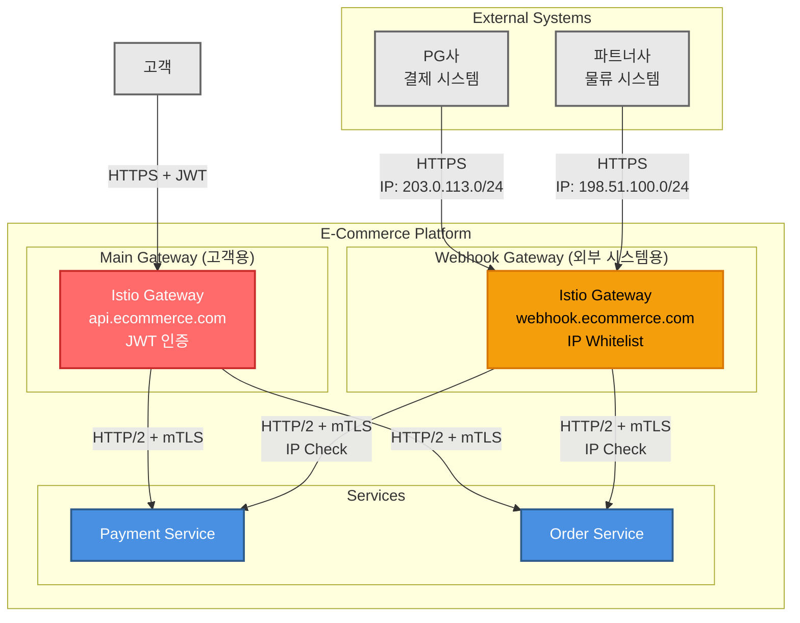

#### 3.4.3 Webhook Gateway 설정

```yaml
# 1. Webhook 전용 Istio Gateway
apiVersion: gateway.networking.k8s.io/v1
kind: Gateway
metadata:
  name: webhook-gateway
  namespace: ecommerce
  annotations:
    cert-manager.io/cluster-issuer: letsencrypt-prod
spec:
  gatewayClassName: istio
  listeners:
  - name: https-webhook
    hostname: "webhook.ecommerce.com"
    port: 443
    protocol: HTTPS
    tls:
      mode: Terminate
      certificateRefs:
      - name: webhook-tls-cert
        kind: Secret
    allowedRoutes:
      namespaces:
        from: Same

---
# 2. HTTPRoute (PG사 Webhook)
apiVersion: gateway.networking.k8s.io/v1
kind: HTTPRoute
metadata:
  name: pg-webhook-route
  namespace: ecommerce
spec:
  parentRefs:
  - name: webhook-gateway
  hostnames:
  - "webhook.ecommerce.com"
  rules:
  - matches:
    - path:
        type: PathPrefix
        value: /webhooks/payment
    backendRefs:
    - name: payment-service
      port: 8080
      weight: 100

---
# 3. HTTPRoute (파트너사 Webhook)
apiVersion: gateway.networking.k8s.io/v1
kind: HTTPRoute
metadata:
  name: partner-webhook-route
  namespace: ecommerce
spec:
  parentRefs:
  - name: webhook-gateway
  hostnames:
  - "webhook.ecommerce.com"
  rules:
  - matches:
    - path:
        type: PathPrefix
        value: /webhooks/order
    backendRefs:
    - name: order-service
      port: 8080
      weight: 100
```

#### 3.4.4 IP Whitelist 보안 설정

```yaml
# AuthorizationPolicy (IP 기반 접근 제어)
apiVersion: security.istio.io/v1
kind: AuthorizationPolicy
metadata:
  name: webhook-ip-whitelist
  namespace: ecommerce
spec:
  selector:
    matchLabels:
      istio.io/gateway-name: webhook-gateway
  action: ALLOW
  rules:
  # PG사 IP만 허용 (Payment Webhook)
  - from:
    - source:
        ipBlocks:
        - "203.0.113.0/24"  # PG사 IP 대역
        - "198.51.100.5/32"  # PG사 Backup IP
    to:
    - operation:
        paths:
        - /webhooks/payment/*
        methods:
        - POST

  # 파트너사 IP만 허용 (Order Webhook)
  - from:
    - source:
        ipBlocks:
        - "198.51.100.0/24"  # 파트너사 IP 대역
    to:
    - operation:
        paths:
        - /webhooks/order/*
        methods:
        - POST

---
# DENY 정책 (명시되지 않은 IP는 차단)
apiVersion: security.istio.io/v1
kind: AuthorizationPolicy
metadata:
  name: webhook-default-deny
  namespace: ecommerce
spec:
  selector:
    matchLabels:
      istio.io/gateway-name: webhook-gateway
  action: DENY
  rules:
  - to:
    - operation:
        paths:
        - /webhooks/*
```

#### 3.4.5 Webhook Rate Limiting

```yaml
apiVersion: networking.istio.io/v1alpha3
kind: EnvoyFilter
metadata:
  name: webhook-rate-limit
  namespace: ecommerce
spec:
  workloadSelector:
    labels:
      istio.io/gateway-name: webhook-gateway
  configPatches:
  - applyTo: HTTP_FILTER
    match:
      context: GATEWAY
    patch:
      operation: INSERT_BEFORE
      value:
        name: envoy.filters.http.ratelimit
        typed_config:
          "@type": type.googleapis.com/envoy.extensions.filters.http.ratelimit.v3.RateLimit
          domain: webhook-ratelimit
          rate_limit_service:
            grpc_service:
              envoy_grpc:
                cluster_name: rate_limit_cluster
---
apiVersion: v1
kind: ConfigMap
metadata:
  name: webhook-ratelimit-config
  namespace: ecommerce
data:
  config.yaml: |
    domain: webhook-ratelimit
    descriptors:
      # PG사 Rate Limit (초당 100 요청)
      - key: source_cluster
        value: "pg-company"
        rate_limit:
          unit: second
          requests_per_unit: 100

      # 파트너사 Rate Limit (초당 50 요청)
      - key: source_cluster
        value: "partner-company"
        rate_limit:
          unit: second
          requests_per_unit: 50
```

#### 3.4.6 Application 레벨 보안

**Payment Webhook Controller 예시**:

```kotlin
@RestController
@RequestMapping("/webhooks/payment")
class PaymentWebhookController(
    private val webhookService: PaymentWebhookService,
) {
    companion object {
        private val logger = LoggerFactory.getLogger(PaymentWebhookController::class.java)
    }

    @PostMapping("/complete")
    fun receivePaymentComplete(
        @RequestBody request: PgWebhookRequest,
        @RequestHeader("X-Forwarded-For", required = false) clientIp: String?,
        @RequestHeader("X-PG-Signature") signature: String,
    ): ResponseEntity<WebhookResponse> {
        logger.info("Received payment webhook from IP: $clientIp")

        // 1. 서명 검증 (PG사 제공 Secret Key로 HMAC-SHA256)
        if (!webhookService.verifySignature(request, signature)) {
            logger.warn("Invalid signature from IP: $clientIp")
            throw UnauthorizedException("Invalid signature")
        }

        // 2. Idempotency 체크 (중복 방지)
        if (webhookService.isDuplicate(request.transactionId)) {
            logger.info("Duplicate webhook ignored: ${request.transactionId}")
            return ResponseEntity.ok(WebhookResponse("already_processed"))
        }

        // 3. 비즈니스 로직 처리
        webhookService.processPaymentComplete(request)

        return ResponseEntity.ok(WebhookResponse("success"))
    }
}

@Service
class PaymentWebhookService(
    private val paymentRepository: PaymentRepositoryImpl,
    private val completePaymentService: CompletePaymentService,
) {
    @Value("\${pg.webhook.secret-key}")
    private lateinit var pgSecretKey: String

    fun verifySignature(request: PgWebhookRequest, signature: String): Boolean {
        val payload = objectMapper.writeValueAsString(request)
        val expectedSignature = HmacUtils.hmacSha256Hex(pgSecretKey, payload)
        return MessageDigest.isEqual(
            signature.toByteArray(),
            expectedSignature.toByteArray()
        )
    }

    fun isDuplicate(transactionId: String): Boolean {
        return paymentRepository.existsByPgTransactionId(transactionId)
    }

    @Transactional
    fun processPaymentComplete(request: PgWebhookRequest) {
        val command = CompletePaymentCommand(
            paymentId = UUID.fromString(request.orderId),
            pgApprovalNumber = request.approvalNumber,
            pgTransactionId = request.transactionId,
        )
        completePaymentService.execute(command)
    }
}
```

#### 3.4.7 Webhook Gateway Metrics

```promql
# Webhook 요청 수 (IP별)
istio_requests_total{
  destination_service="payment-service.ecommerce.svc.cluster.local",
  source_principal=~"webhook-gateway.*",
  response_code="200"
}

# Webhook 응답 시간 (P95)
histogram_quantile(0.95,
  sum(rate(istio_request_duration_milliseconds_bucket{
    destination_service="payment-service.ecommerce.svc.cluster.local",
    source_principal=~"webhook-gateway.*"
  }[5m])) by (le)
)

# IP Whitelist 차단된 요청 수
istio_requests_total{
  destination_service="payment-service.ecommerce.svc.cluster.local",
  source_principal=~"webhook-gateway.*",
  response_code="403"
}

# Rate Limit으로 차단된 요청 수
envoy_http_ratelimit_rejected_total{
  envoy_http_conn_manager_prefix="webhook-gateway"
}
```

### 3.5 Istio Gateway Metrics

**Prometheus Metrics** (Istio 기본 통합):

Istio는 자동으로 Envoy 프록시 메트릭을 Prometheus로 노출합니다.

**주요 Metrics**:

```promql
# Gateway 요청 수 (라우트별)
istio_requests_total{
  destination_service="order-service.ecommerce.svc.cluster.local",
  response_code="200"
}

# Gateway 응답 시간 (P95)
histogram_quantile(0.95,
  sum(rate(istio_request_duration_milliseconds_bucket{
    destination_service=~".*-service.ecommerce.svc.cluster.local"
  }[5m])) by (le, destination_service)
)

# Circuit Breaker 상태 (Outlier Detection)
envoy_cluster_outlier_detection_ejections_active{
  cluster_name="outbound|8080||order-service.ecommerce.svc.cluster.local"
}

# Rate Limit 차단된 요청 수
envoy_http_ratelimit_rejected_total{
  envoy_http_conn_manager_prefix="ecommerce-gateway"
}

# mTLS 연결 수
istio_tcp_connections_opened_total{
  source_workload_namespace="ecommerce",
  connection_security_policy="mutual_tls"
}

# Gateway 처리량
envoy_http_downstream_rq_total{
  envoy_http_conn_manager_prefix="ecommerce-gateway"
}
```

**Grafana 대시보드**:
- Istio Mesh Dashboard (전체 트래픽 흐름)
- Istio Service Dashboard (서비스별 메트릭)
- Istio Workload Dashboard (Pod별 메트릭)
- Envoy Global Dashboard (Gateway 메트릭)

---

## 4. MSA Services

### 4.1 서비스 간 통신 패턴

```mermaid
graph TB
    subgraph "동기 통신 (Request/Response via Istio)"
        Gateway["Istio Gateway"]
        Service1["Order Service"]
        Service2["Product Service"]

        Gateway -->|HTTP/2 + mTLS| Service1
        Gateway -->|HTTP/2 + mTLS| Service2
    end

    subgraph "비동기 통신 (Event-Driven)"
        ServiceA["Order Service"]
        Kafka["Kafka"]
        ServiceB["Product Service"]
        ServiceC["Payment Service"]

        ServiceA -.->|Publish<br/>OrderCreatedEvent| Kafka
        Kafka -.->|Subscribe| ServiceB
        Kafka -.->|Subscribe| ServiceC
    end

    subgraph "서비스 간 직접 호출 (Istio mTLS)"
        ServiceX["Payment Service"]
        ServiceY["Order Service"]

        ServiceX -->|HTTP + mTLS| ServiceY
    end

    classDef gatewayStyle fill:#FF6B6B,stroke:#C92A2A,stroke-width:2px,color:#fff
    classDef serviceStyle fill:#4A90E2,stroke:#2E5C8A,stroke-width:2px,color:#fff
    classDef kafkaStyle fill:#231F20,stroke:#000,stroke-width:2px,color:#fff

    class Gateway gatewayStyle
    class Service1,Service2,ServiceA,ServiceB,ServiceC,ServiceX,ServiceY serviceStyle
    class Kafka kafkaStyle
```

**통신 규칙 (Istio 적용)**:

1. ✅ **Client → Service**:
   - Istio Gateway를 통한 라우팅
   - L7 트래픽 관리 (라우팅, 재시도, 타임아웃)
   - mTLS 자동 암호화

2. ✅ **Service → Service (비동기)**:
   - Kafka 이벤트 기반 통신 (권장)
   - 느슨한 결합 유지

3. ✅ **Service → Service (동기 - mTLS)**:
   - Port/Adapter 패턴으로 추상화 (MSA 전환 대비)
   - Istio가 자동으로 mTLS 적용
   - Zero Trust 네트워크 보안
   - Identity-based 인증

4. ❌ **Service → Service (직접 DB 접근)**:
   - 절대 금지

**Istio mTLS 통신 특징**:
- ✅ **투명한 mTLS**: 애플리케이션 코드 변경 없음
- ✅ **Zero Trust**: 서비스 간 신원 기반 인증
- ✅ **자동 인증서 관리**: Istio가 자동으로 인증서 발급 및 갱신
- ✅ **Network Policy**: L4/L7 보안 정책 적용

### 4.2 서비스별 상세 구성

#### 4.2.1 Order Service

**책임**:
- 주문 생성, 조회, 취소
- Saga 시작 (OrderCreation Saga)

**의존성**:
- **Product Service** (Port/Adapter): 재고 확인 (이벤트 기반)
- **Payment Service** (Port/Adapter): 결제 완료 확인 (이벤트 기반)
- **Kafka**: OrderCreatedEvent, OrderCancelledEvent 발행

**데이터베이스**: `order_db` (PostgreSQL)
```sql
Tables:
- p_order (주문)
- p_order_item (주문 항목)
- p_delivery (배송 정보)
```

**API Endpoints**:
```
POST   /api/v1/orders          # 주문 생성
GET    /api/v1/orders/{id}     # 주문 조회
DELETE /api/v1/orders/{id}     # 주문 취소
GET    /api/v1/orders          # 주문 목록 조회
```

#### 4.2.2 Product Service

**책임**:
- 상품 등록, 수정, 삭제
- 재고 관리 (차감, 복구)

**의존성**:
- **Store Service** (Port/Adapter): 상점 정보 조회
- **Kafka**: StockReservedEvent, StockReleasedEvent 발행

**데이터베이스**: `product_db` (PostgreSQL)
```sql
Tables:
- p_product (상품)
- p_stock (재고)
- p_category (카테고리)
```

**API Endpoints**:
```
POST   /api/v1/products        # 상품 등록
GET    /api/v1/products/{id}   # 상품 조회
PUT    /api/v1/products/{id}   # 상품 수정
DELETE /api/v1/products/{id}   # 상품 삭제
POST   /api/v1/products/{id}/stock/reserve  # 재고 차감
POST   /api/v1/products/{id}/stock/release  # 재고 복구
```

#### 4.2.3 Payment Service

**책임**:
- 결제 요청, 완료, 취소, 환불
- PG사 연동

**의존성**:
- **Order Service** (Port/Adapter): 주문 정보 조회
- **PG System** (External API): 결제 처리
- **Kafka**: PaymentCompletedEvent, PaymentFailedEvent 발행

**데이터베이스**: `payment_db` (PostgreSQL)
```sql
Tables:
- p_payment (결제)
- p_payment_history (결제 이력)
```

**API Endpoints**:
```
POST   /api/v1/payments/request   # 결제 요청
POST   /api/v1/payments/complete  # 결제 완료
POST   /api/v1/payments/{id}/cancel    # 결제 취소
POST   /api/v1/payments/{id}/refund    # 환불
GET    /api/v1/payments/{id}      # 결제 조회
```

#### 4.2.4 Store Service

**책임**:
- 상점 생성, 수정, 출시
- 상점 상태 관리

**의존성**:
- **User Service** (Port/Adapter): 사용자 정보 조회
- **Kafka**: StoreCreatedEvent, StoreLaunchedEvent 발행

**데이터베이스**: `store_db` (PostgreSQL)
```sql
Tables:
- p_store (상점)
- p_store_audit_log (감사 로그)
```

**API Endpoints**:
```
POST   /api/v1/stores          # 상점 생성
GET    /api/v1/stores/{id}     # 상점 조회
PUT    /api/v1/stores/{id}     # 상점 수정
DELETE /api/v1/stores/{id}     # 상점 삭제
POST   /api/v1/stores/{id}/launch  # 상점 출시
```

#### 4.2.5 Recommendation Service

**책임**:
- 상품 유사도 기반 추천 (Feature-based Similarity)
- 실시간 유사도 업데이트 (이벤트 기반)
- 추천 결과 캐싱 및 제공

**의존성**:
- **Product Service** (Port/Adapter): 상품 메타데이터 조회
- **Kafka**: ProductCreatedEvent, ProductUpdatedEvent 구독
- **Redis**: 추천 결과 캐싱
- **Airflow**: 일일 배치 유사도 재계산

**데이터베이스**: `recommendation_db` (PostgreSQL)
```sql
Tables:
- product_similarity (상품 간 유사도)
  - source_product_id, target_product_id, score, algorithm, updated_at
- similarity_metadata (알고리즘 메타데이터)
```

**추천 알고리즘**:
- **TF-IDF Cosine Similarity** (40%): 상품 설명 텍스트 기반
- **Jaccard Similarity** (30%): 태그 집합 기반
- **Category Overlap** (20%): 카테고리 일치도
- **Brand Match** (10%): 동일 브랜드 여부

**API Endpoints**:
```
GET    /api/v1/recommendations/products/{id}/similar  # 유사 상품 조회
POST   /api/v1/recommendations/refresh                # 캐시 갱신 (관리자)
```

**성능 목표**:
- 응답 시간 (P95): < 100ms (캐시 히트)
- 캐시 히트율: > 90%
- 일일 배치 완료 시간: < 2시간

#### 4.2.6 Analytics Service

**책임**:
- 비즈니스 이벤트 수집 및 집계
- 통계 데이터 생성 (주문, 판매, 조회수)
- 데이터 분석 기반 제공

**의존성**:
- **Kafka**: 모든 비즈니스 이벤트 구독 (order-events, product-events, payment-events 등)

**데이터베이스**: `analytics_db` (PostgreSQL)
```sql
Tables:
- daily_product_stats (일별 상품 통계)
- daily_order_stats (일별 주문 통계)
- user_activity_log (사용자 활동 로그)
```

**API Endpoints**:
```
GET    /api/v1/analytics/products/{id}/stats     # 상품 통계 조회
GET    /api/v1/analytics/stores/{id}/stats       # 상점 통계 조회
GET    /api/v1/analytics/orders/daily            # 일별 주문 통계
```

**집계 주기**:
- 실시간 이벤트 수집
- 시간별 집계: 매시간 정각
- 일별 집계: 매일 새벽 2시

### 4.3 서비스 배포 전략

**Rolling Update** (기본):
```yaml
apiVersion: apps/v1
kind: Deployment
metadata:
  name: order-service
spec:
  replicas: 3
  strategy:
    type: RollingUpdate
    rollingUpdate:
      maxUnavailable: 1  # 최대 1개 Pod만 다운
      maxSurge: 1        # 최대 1개 Pod만 추가 생성
```

**Blue-Green Deployment** (중요 서비스):
- Payment Service, Order Service는 Blue-Green 배포
- Kubernetes Service의 Selector를 변경하여 트래픽 전환

---

## 5. Event Streaming

### 5.1 Kafka 토픽 전략

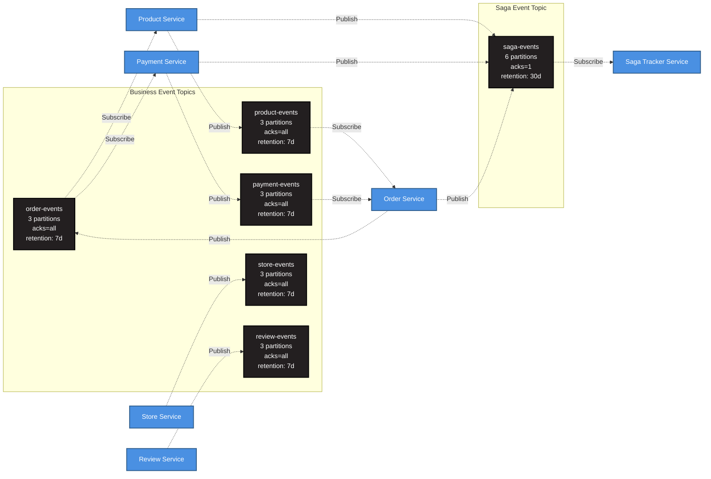

### 5.2 이벤트 스키마 (Avro)

**OrderCreatedEvent** (order-events):
```json
{
  "type": "record",
  "name": "OrderCreatedEvent",
  "namespace": "com.groom.ecommerce.order.event",
  "fields": [
    {"name": "eventType", "type": "string", "default": "OrderCreatedEvent"},
    {"name": "orderId", "type": "string"},
    {"name": "userId", "type": "string"},
    {"name": "items", "type": {"type": "array", "items": "OrderItem"}},
    {"name": "totalAmount", "type": "double"},
    {"name": "timestamp", "type": "long"},
    {"name": "traceId", "type": ["null", "string"], "default": null}
  ]
}
```

**StockReservedEvent** (product-events):
```json
{
  "type": "record",
  "name": "StockReservedEvent",
  "namespace": "com.groom.ecommerce.product.event",
  "fields": [
    {"name": "eventType", "type": "string", "default": "StockReservedEvent"},
    {"name": "orderId", "type": "string"},
    {"name": "productId", "type": "string"},
    {"name": "quantity", "type": "int"},
    {"name": "timestamp", "type": "long"}
  ]
}
```

**ProductCreatedEvent** (product-events):
```json
{
  "type": "record",
  "name": "ProductCreatedEvent",
  "namespace": "com.groom.ecommerce.product.event",
  "fields": [
    {"name": "eventType", "type": "string", "default": "ProductCreatedEvent"},
    {"name": "productId", "type": "string"},
    {"name": "storeId", "type": "string"},
    {"name": "name", "type": "string"},
    {"name": "categoryId", "type": "string"},
    {"name": "brand", "type": ["null", "string"], "default": null},
    {"name": "tags", "type": {"type": "array", "items": "string"}},
    {"name": "description", "type": ["null", "string"], "default": null},
    {"name": "timestamp", "type": "long"}
  ]
}
```

**ProductUpdatedEvent** (product-events):
```json
{
  "type": "record",
  "name": "ProductUpdatedEvent",
  "namespace": "com.groom.ecommerce.product.event",
  "fields": [
    {"name": "eventType", "type": "string", "default": "ProductUpdatedEvent"},
    {"name": "productId", "type": "string"},
    {"name": "updatedFields", "type": {"type": "array", "items": "string"}},
    {"name": "timestamp", "type": "long"}
  ]
}
```

### 5.3 Event-Driven Saga 플로우

상세한 Saga 플로우는 `saga-choreography-pattern.md` 및 `saga-event-tracker-architecture.md` 참조.

---

## 6. 데이터 저장소

### 6.1 Database per Service 패턴

```mermaid
graph TB
    subgraph "MSA Services & Databases"
        subgraph "Order Domain"
            OrderSvc[Order Service]
            OrderDB[(order_db<br/>PostgreSQL)]
            OrderSvc --> OrderDB
        end

        subgraph "Product Domain"
            ProductSvc[Product Service]
            ProductDB[(product_db<br/>PostgreSQL)]
            ProductSvc --> ProductDB
        end

        subgraph "Payment Domain"
            PaymentSvc[Payment Service]
            PaymentDB[(payment_db<br/>PostgreSQL)]
            PaymentSvc --> PaymentDB
        end

        subgraph "Store Domain"
            StoreSvc[Store Service]
            StoreDB[(store_db<br/>PostgreSQL)]
            StoreSvc --> StoreDB
        end

        subgraph "User Domain"
            UserSvc[User Service]
            UserDB[(user_db<br/>PostgreSQL)]
            UserSvc --> UserDB
        end

        subgraph "Authorization Domain"
            AuthSvc[Authorization Service]
            AuthDB[(auth_db<br/>PostgreSQL)]
            AuthSvc --> AuthDB
        end

        subgraph "Review Domain"
            ReviewSvc[Review Service]
            ReviewDB[(review_db<br/>PostgreSQL)]
            ReviewSvc --> ReviewDB
        end

        subgraph "Saga Tracking Domain"
            SagaSvc[Saga Tracker Service]
            SagaDB[(saga_db<br/>PostgreSQL)]
            SagaSvc --> SagaDB
        end

        subgraph "Recommendation Domain"
            RecommendSvc[Recommendation Service]
            RecommendDB[(recommendation_db<br/>PostgreSQL)]
            RecommendSvc --> RecommendDB
        end

        subgraph "Analytics Domain"
            AnalyticsSvc[Analytics Service]
            AnalyticsDB[(analytics_db<br/>PostgreSQL)]
            AnalyticsSvc --> AnalyticsDB
        end
    end

    subgraph "Shared Cache"
        Redis[(Redis Cluster<br/>- Token Blacklist<br/>- Rate Limit Counters<br/>- Recommendation Cache<br/>- Application Cache)]
    end

    OrderSvc -.->|Cache| Redis
    ProductSvc -.->|Cache| Redis
    PaymentSvc -.->|Cache| Redis
    RecommendSvc -.->|Cache| Redis

    classDef serviceStyle fill:#4A90E2,stroke:#2E5C8A,stroke-width:2px,color:#fff
    classDef dbStyle fill:#50C878,stroke:#3A9B5C,stroke-width:2px,color:#fff
    classDef cacheStyle fill:#E85D75,stroke:#C74562,stroke-width:2px,color:#fff

    class OrderSvc,ProductSvc,PaymentSvc,StoreSvc,UserSvc,AuthSvc,ReviewSvc,SagaSvc,RecommendSvc,AnalyticsSvc serviceStyle
    class OrderDB,ProductDB,PaymentDB,StoreDB,UserDB,AuthDB,ReviewDB,SagaDB,RecommendDB,AnalyticsDB dbStyle
    class Redis cacheStyle
```

**원칙**:
- ✅ **각 서비스는 자신의 데이터베이스만 소유**
- ✅ **다른 서비스의 DB에 직접 접근 금지**
- ✅ **데이터 공유는 이벤트 또는 API를 통해서만**
- ✅ **Redis는 공유 캐시/세션 스토어로 사용 (상태 비저장 데이터)**

### 6.2 Database 스키마 관리

**Flyway** 기반 마이그레이션:

```
각 서비스별 migration 디렉토리:
e-commerce/src/main/resources/db/migration/
├── order/
│   ├── V1__create_order_tables.sql
│   ├── V2__add_order_status_column.sql
│   └── V3__create_delivery_table.sql
├── product/
│   ├── V1__create_product_tables.sql
│   └── V2__add_stock_tracking.sql
└── payment/
    ├── V1__create_payment_tables.sql
    └── V2__create_payment_history.sql
```

---

## 7. 모니터링 및 관찰성

### 7.1 Three Pillars of Observability

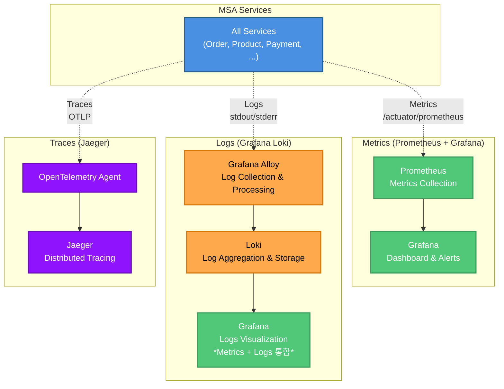

**Grafana Loki Stack 선택 이유**:

| 특징 | Grafana Loki | ELK Stack | 비고 |
|------|--------------|-----------|------|
| **비용** | 낮음 (인덱싱 최소화) | 높음 (전체 로그 인덱싱) | Loki는 라벨만 인덱싱 |
| **저장소 요구사항** | 낮음 (압축 효율 높음) | 높음 (Elasticsearch 필요) | Loki는 50Gi, ELK는 100Gi+ |
| **쿼리 성능** | LogQL (간단, 빠름) | Lucene Query (복잡) | Prometheus와 유사한 문법 |
| **Grafana 통합** | 네이티브 지원 | 플러그인 필요 | Metrics + Logs 단일 대시보드 |
| **확장성** | 수평 확장 용이 | 복잡한 클러스터 관리 | Loki는 StatefulSet 간단 |
| **러닝 커브** | 낮음 (Prometheus 사용자) | 높음 (Elasticsearch DSL) | 팀 생산성 향상 |

**Alloy (Grafana Agent 후속)**:
- **다목적 수집기**: Logs + Metrics + Traces 모두 수집 가능
- **경량**: DaemonSet으로 각 Node에 배포, 낮은 리소스 사용
- **Pipeline**: 로그 필터링, 변환, 라벨링 기능
- **OpenTelemetry 호환**: OTLP 프로토콜 지원

### 7.2 주요 Metrics

**서비스별 공통 Metrics**:
```promql
# HTTP 요청 수
http_server_requests_total{service="order-service", status="200"}

# HTTP 응답 시간 (P95)
histogram_quantile(0.95, sum(rate(http_server_requests_seconds_bucket[5m])) by (le, service))

# JVM 메모리 사용량
jvm_memory_used_bytes{service="order-service", area="heap"}

# Kafka Consumer Lag
kafka_consumer_lag{topic="order-events", group="order-service"}

# Database Connection Pool
hikaricp_connections_active{pool="order-db"}
```

**Recommendation Service 전용 Metrics**:
```promql
# 추천 API 응답 시간 (P95)
histogram_quantile(0.95, sum(rate(http_server_requests_seconds_bucket{service="recommendation-service", uri="/api/v1/recommendations/products/{id}/similar"}[5m])) by (le))

# 캐시 히트율
rate(recommendation_cache_hits_total[5m]) / (rate(recommendation_cache_hits_total[5m]) + rate(recommendation_cache_misses_total[5m]))

# 유사도 계산 시간 (이벤트 기반)
histogram_quantile(0.95, sum(rate(recommendation_similarity_calculation_seconds_bucket[5m])) by (le))

# 저장된 유사도 데이터 수
recommendation_similarity_records_total

# ProductCreatedEvent 처리 시간
histogram_quantile(0.95, sum(rate(recommendation_event_processing_seconds_bucket{event_type="ProductCreatedEvent"}[5m])) by (le))
```

**Airflow Batch Metrics**:
```promql
# 배치 작업 성공률
airflow_dag_run_success_total{dag_id="product_similarity_batch"} / airflow_dag_run_total{dag_id="product_similarity_batch"}

# 배치 작업 완료 시간
airflow_dag_run_duration_seconds{dag_id="product_similarity_batch"}

# 배치 작업 실패 수
rate(airflow_dag_run_failed_total{dag_id="product_similarity_batch"}[1h])
```

**Analytics Service 전용 Metrics**:
```promql
# 이벤트 처리 수
rate(analytics_events_processed_total[5m])

# 이벤트 처리 지연 시간
histogram_quantile(0.95, sum(rate(analytics_event_processing_seconds_bucket[5m])) by (le))

# 집계 데이터 생성 건수
rate(analytics_aggregation_records_total[1h])
```

### 7.3 Distributed Tracing

**Trace Context 전파**:
```
Client Request
  └─ API Gateway (Trace ID 생성: trace-123)
      ├─ Order Service (Span ID: span-1, Parent: trace-123)
      │   └─ Kafka Producer (Span ID: span-2, Parent: span-1)
      │       └─ Product Service (Span ID: span-3, Parent: span-2)
      │           └─ Payment Service (Span ID: span-4, Parent: span-3)
      └─ Response
```

### 7.4 로그 쿼리 (LogQL)

**Grafana Loki LogQL 예시**:

```logql
# 특정 서비스의 에러 로그 조회
{service="order-service", level="ERROR"}

# 특정 사용자의 로그만 필터링
{service="order-service"} |= "userId=user-123"

# HTTP 500 에러만 조회
{service="api-gateway"} |= "status=500"

# 특정 시간대의 로그 카운트 (rate)
rate({service="order-service"}[5m])

# 로그 패턴 파싱 및 집계
{service="payment-service"}
  | json
  | line_format "{{.level}} {{.message}}"
  | level="ERROR"

# 여러 서비스의 로그를 trace ID로 연결
{service=~"order-service|product-service|payment-service"}
  |= "traceId=abc123"

# 에러 발생 횟수 집계 (by service)
sum by (service) (count_over_time({level="ERROR"}[1h]))
```

**Grafana 대시보드 통합**:
```
동일 대시보드에서 Metrics + Logs 조회 가능:
- Panel 1: HTTP 요청 수 (Prometheus)
- Panel 2: 에러 로그 (Loki)
- Panel 3: Trace 상세 (Jaeger)

Trace ID 클릭 → Loki 로그 자동 필터링 → Jaeger Trace 상세 보기
```

---

## 8. 인프라 구성

### 8.1 Kubernetes 아키텍처

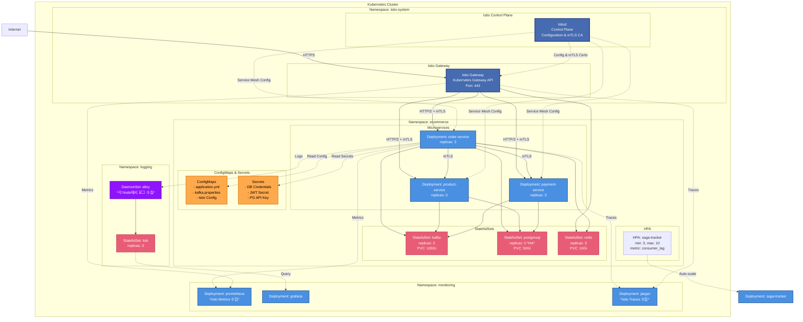

### 8.2 리소스 할당

| 컴포넌트 | Type | Replicas | CPU Request | CPU Limit | Memory Request | Memory Limit | Storage |
|---------|------|----------|-------------|-----------|----------------|--------------|---------|
| **Istiod (Control Plane)** | Deployment | 2 | 500m | 1000m | 2Gi | 4Gi | - |
| **Main Istio Gateway** | Deployment | 3 | 500m | 1000m | 1Gi | 2Gi | - |
| **Webhook Gateway** | Deployment | 2 | 300m | 600m | 512Mi | 1Gi | - |
| **Order Service** | Deployment | 3 | 500m | 1000m | 1Gi | 2Gi | - |
| **Product Service** | Deployment | 3 | 500m | 1000m | 1Gi | 2Gi | - |
| **Payment Service** | Deployment | 3 | 500m | 1000m | 1Gi | 2Gi | - |
| **Recommendation Service** | Deployment | 2 | 500m | 1000m | 1Gi | 2Gi | - |
| **Analytics Service** | Deployment | 2 | 500m | 1000m | 1Gi | 2Gi | - |
| **Saga Tracker** | Deployment + HPA | 3-10 | 250m | 500m | 512Mi | 1Gi | - |
| **Airflow Scheduler** | Deployment | 1 | 500m | 1000m | 1Gi | 2Gi | - |
| **Airflow Worker** | Deployment | 2 | 1000m | 2000m | 2Gi | 4Gi | - |
| **Kafka** | StatefulSet | 3 | 1000m | 2000m | 2Gi | 4Gi | 100Gi PVC |
| **PostgreSQL** | StatefulSet | 3 (HA) | 1000m | 2000m | 2Gi | 4Gi | 50Gi PVC |
| **Redis** | StatefulSet | 3 | 500m | 1000m | 1Gi | 2Gi | 10Gi PVC |
| **Prometheus** | Deployment | 1 | 500m | 1000m | 2Gi | 4Gi | 20Gi PVC |
| **Grafana** | Deployment | 1 | 250m | 500m | 512Mi | 1Gi | 5Gi PVC |
| **Loki** | StatefulSet | 3 | 500m | 1000m | 2Gi | 4Gi | 50Gi PVC |
| **Alloy** | DaemonSet | N (각 Node) | 100m | 200m | 256Mi | 512Mi | - |

> **Note**: Istio 배포 모드에 따라 추가 리소스가 필요할 수 있습니다 (Sidecar: Pod당 Envoy 프록시, Ambient Mesh: Node당 ztunnel + Waypoint Proxy).

---

## 9. 보안 아키텍처

### 9.1 인증 및 인가 플로우 (Istio Gateway)

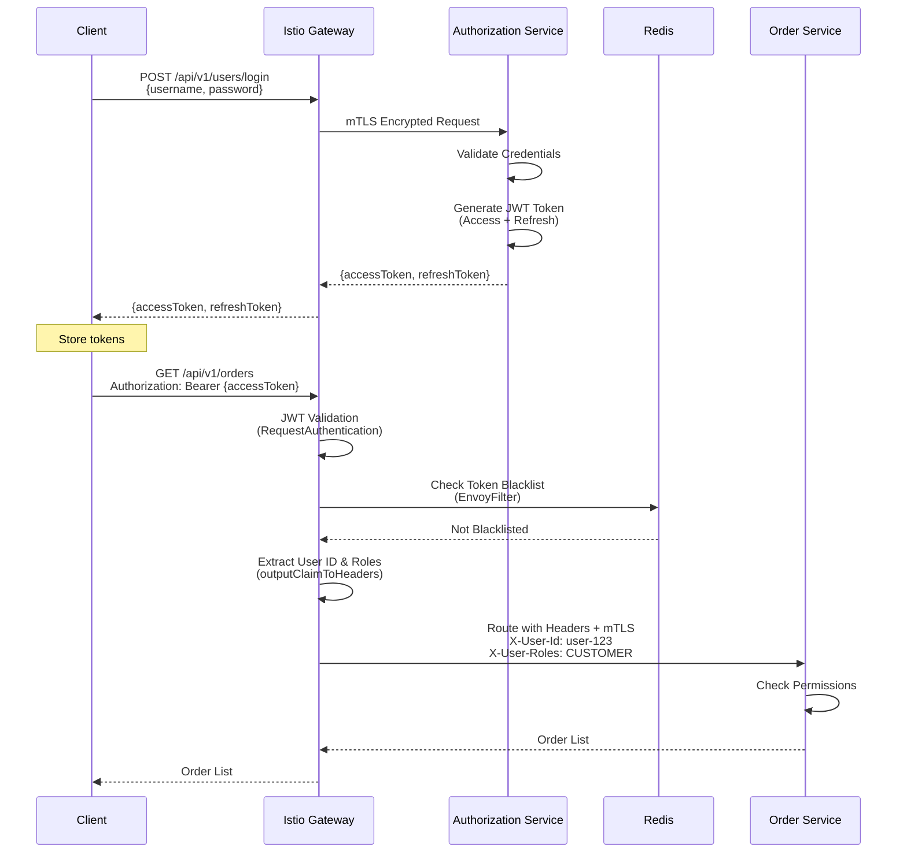

### 9.2 JWT Token 구조

**Access Token** (유효기간: 5분):
```json
{
  "header": {
    "alg": "RS256",
    "typ": "JWT"
  },
  "payload": {
    "sub": "user-123",
    "jti": "550e8400-e29b-41d4-a716-446655440000",
    "userId": "550e8400-e29b-41d4-a716-446655440001",
    "roles": ["CUSTOMER"],
    "permissions": ["order:read", "order:write"],
    "iat": 1609459200,
    "exp": 1609459500
  }
}
```

**jti (JWT Token ID)**:
- 각 Access Token의 고유 식별자 (UUID)
- 로그아웃 시 Token Blacklist의 Key로 사용
- Token 재사용 방지 및 추적 가능

**Refresh Token** (유효기간: 3일):
```json
{
  "payload": {
    "sub": "user-123",
    "tokenId": "refresh-token-uuid",
    "iat": 1609459200,
    "exp": 1609718400
  }
}
```

**Refresh Token 저장**:
- **저장 위치 (Server)**: PostgreSQL Database (`p_user_refresh_token` 테이블)
- **저장 위치 (Client)**: HttpOnly Cookie 또는 Secure Storage
- **단일 디바이스 로그인**: 사용자당 1개의 Refresh Token만 DB에 저장 (UNIQUE 제약 조건)
- **새 로그인 시**: 기존 Refresh Token 덮어쓰기 → 기존 디바이스 자동 로그아웃

### 9.3 로그아웃 및 Token Blacklist

**로그아웃 플로우 (Istio Gateway)**:

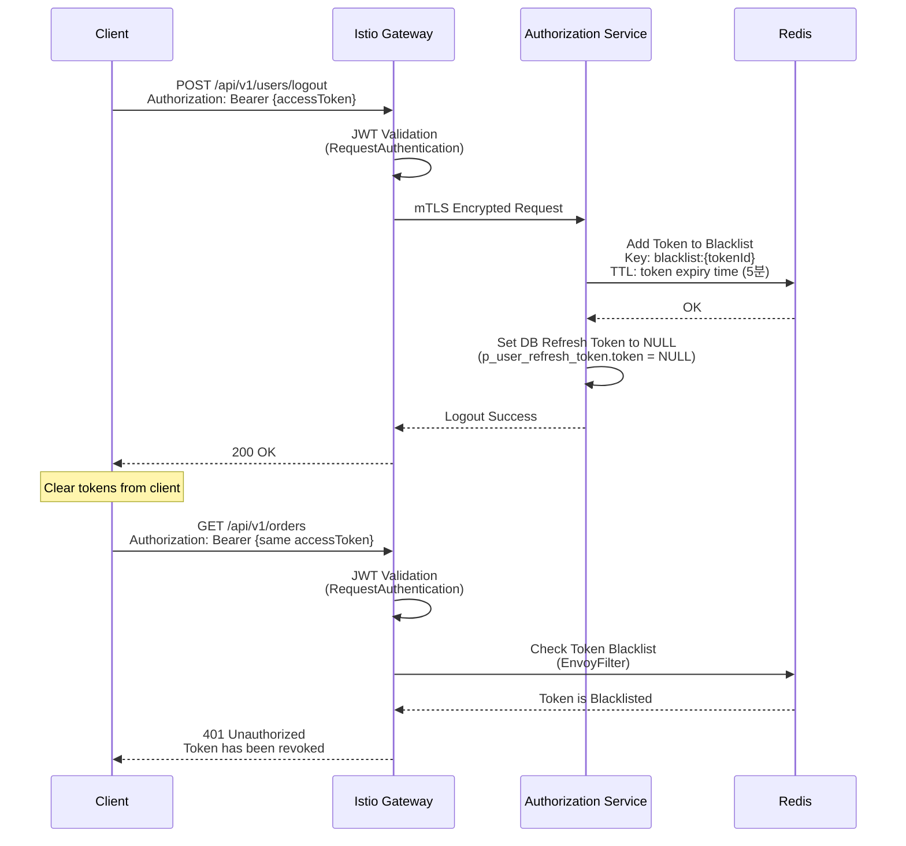

**Redis Token Blacklist 구조**:

```redis
# Access Token Blacklist (로그아웃 시 추가)
Key:   blacklist:{jti}  # jti = JWT Token ID (payload의 고유 ID)
Value: {userId}
TTL:   {token 만료 시간까지 남은 시간} (예: 5분 = 300초)

# 예시
SET blacklist:550e8400-e29b-41d4-a716-446655440000 "user-123" EX 300
```

**PostgreSQL Refresh Token 구조** (`p_user_refresh_token` 테이블):

```sql
CREATE TABLE p_user_refresh_token (
    id              UUID PRIMARY KEY DEFAULT gen_random_uuid(),
    user_id         UUID NOT NULL,
    token           TEXT NULL,                    -- NULL이면 로그아웃 상태
    client_ip       INET,
    expires_at      TIMESTAMPTZ NOT NULL,
    created_at      TIMESTAMPTZ NOT NULL DEFAULT now(),
    updated_at      TIMESTAMPTZ NOT NULL DEFAULT now(),

    UNIQUE (user_id)  -- 사용자당 1개의 Refresh Token만 저장 (단일 디바이스 로그인)
);
```

**Refresh Token 동작**:
- **로그인 시**: 새로운 Refresh Token을 DB에 저장 (기존 토큰 덮어쓰기)
- **로그아웃 시**: `token` 필드를 `NULL`로 설정
- **토큰 갱신 시**:
  1. 요청의 Refresh Token과 DB의 Token 비교
  2. 불일치 시 → 401 에러 (다른 디바이스에서 로그인했음)
  3. NULL인 경우 → 401 에러 (로그아웃 상태)
  4. 일치 시 → 새로운 Access Token 발급

**Token Blacklist 체크 로직** (API Gateway):

```kotlin
@Component
class JwtAuthenticationFilter : GlobalFilter {

    @Autowired
    private lateinit var redisTemplate: RedisTemplate<String, String>

    override fun filter(exchange: ServerWebExchange, chain: GatewayFilterChain): Mono<Void> {
        val token = extractToken(exchange.request) ?: return unauthorized(exchange)

        // 1. JWT 서명 검증
        if (!jwtTokenProvider.validateToken(token)) {
            return unauthorized(exchange)
        }

        // 2. Token Blacklist 체크 (Redis)
        val jti = jwtTokenProvider.getTokenId(token)  // JWT ID (jti claim)
        val isBlacklisted = redisTemplate.hasKey("blacklist:$jti")

        if (isBlacklisted == true) {
            return unauthorizedWithMessage(exchange, "Token has been revoked")
        }

        // 3. User Context 전파
        val userId = jwtTokenProvider.getUserId(token)
        val mutatedRequest = exchange.request.mutate()
            .header("X-User-Id", userId)
            .build()

        return chain.filter(exchange.mutate().request(mutatedRequest).build())
    }
}
```

**JWT Token에 jti (Token ID) 추가**:

```kotlin
// Access Token 생성 시 jti 추가
fun generateAccessToken(userId: String, roles: List<String>): String {
    val now = Date()
    val expiryDate = Date(now.time + ACCESS_TOKEN_EXPIRY)

    return Jwts.builder()
        .setSubject(userId)
        .setId(UUID.randomUUID().toString())  // jti (JWT Token ID)
        .claim("userId", userId)
        .claim("roles", roles)
        .setIssuedAt(now)
        .setExpiration(expiryDate)
        .signWith(privateKey, SignatureAlgorithm.RS256)
        .compact()
}
```

**로그아웃 API 구현**:

```kotlin
@RestController
@RequestMapping("/api/v1/users")
class UserController(
    private val redisTemplate: RedisTemplate<String, String>,
    private val jwtTokenProvider: JwtTokenProvider,
    private val refreshTokenRepository: RefreshTokenRepository,
) {

    @PostMapping("/logout")
    @Transactional
    fun logout(@RequestHeader("Authorization") authHeader: String): ResponseEntity<Void> {
        val token = authHeader.removePrefix("Bearer ")

        // JWT에서 jti 및 userId 추출
        val jti = jwtTokenProvider.getTokenId(token)
        val userId = jwtTokenProvider.getUserId(token)
        val expiryTime = jwtTokenProvider.getExpiryTime(token)

        // 1. Access Token을 Blacklist에 추가 (TTL: 만료 시간까지, 5분)
        val ttl = (expiryTime.time - System.currentTimeMillis()) / 1000
        redisTemplate.opsForValue().set("blacklist:$jti", userId, ttl, TimeUnit.SECONDS)

        // 2. DB의 Refresh Token을 NULL로 설정 (로그아웃 상태)
        refreshTokenRepository.findByUserId(UUID.fromString(userId))?.let {
            it.logout()  // token = null, expiresAt = null
            refreshTokenRepository.save(it)
        }

        return ResponseEntity.ok().build()
    }
}
```

**Token Blacklist의 메모리 효율성**:
- TTL 기반 자동 만료: Access Token 만료 시간 이후 자동 삭제
- 5분 TTL이므로 메모리 사용량 매우 낮음
- 예: 1,000명 동시 로그아웃 시 약 1MB 미만 (각 키 ~1KB)

**단일 디바이스 로그인 보장**:
- DB의 `UNIQUE (user_id)` 제약 조건으로 사용자당 1개의 Refresh Token만 저장
- 새로운 디바이스에서 로그인 시 기존 Refresh Token 덮어쓰기
- 기존 디바이스에서 토큰 갱신 시도 시 DB 토큰 불일치 → 401 에러 → 자동 로그아웃

### 9.4 인증 API 명세

#### 9.4.1 로그인 API

**Endpoint**: `POST /api/v1/auth/login`

**Request**:
```json
{
  "email": "user@example.com",
  "password": "password123"
}
```

**Response (성공 - 200 OK)**:
```json
{
  "accessToken": "eyJhbGciOiJSUzI1NiIsInR5cCI6IkpXVCJ9...",
  "refreshToken": "eyJhbGciOiJSUzI1NiIsInR5cCI6IkpXVCJ9...",
  "tokenType": "Bearer",
  "expiresIn": 300
}
```

**Response (실패 - 401 Unauthorized)**:
```json
{
  "error": "INVALID_CREDENTIALS",
  "message": "이메일 또는 비밀번호가 올바르지 않습니다."
}
```

**처리 로직**:
1. 이메일과 비밀번호 검증
2. 새로운 Access Token 생성 (유효기간: 5분)
3. 새로운 Refresh Token 생성 (유효기간: 3일)
4. DB에 새로운 Refresh Token 저장 (기존 토큰 덮어쓰기)
5. 토큰 반환

#### 9.4.2 로그아웃 API

**Endpoint**: `POST /api/v1/auth/logout`

**Request**:
```http
POST /api/v1/auth/logout
Authorization: Bearer {accessToken}
Content-Type: application/json

{
  "refreshToken": "eyJhbGciOiJSUzI1NiIsInR5cCI6IkpXVCJ9..."
}
```

**Response (성공 - 200 OK)**:
```json
{
  "message": "로그아웃되었습니다."
}
```

**Response (실패 - 401 Unauthorized)**:
```json
{
  "error": "UNAUTHORIZED",
  "message": "인증이 필요합니다."
}
```

**처리 로직**:
1. Access Token 검증
2. 사용자 식별
3. DB의 `token` 필드를 `NULL`로 갱신 (로그아웃 상태)
4. Redis Blacklist에 Access Token 추가 (TTL: 5분)
5. 성공 메시지 반환

#### 9.4.3 Access Token 갱신 API

**Endpoint**: `POST /api/v1/auth/refresh`

**Request**:
```json
{
  "refreshToken": "eyJhbGciOiJSUzI1NiIsInR5cCI6IkpXVCJ9..."
}
```

**Response (성공 - 200 OK)**:
```json
{
  "accessToken": "eyJhbGciOiJSUzI1NiIsInR5cCI6IkpXVCJ9...",
  "tokenType": "Bearer",
  "expiresIn": 300
}
```

**Response (실패 - 토큰 불일치 - 401 Unauthorized)**:
```json
{
  "error": "INVALID_REFRESH_TOKEN",
  "message": "다시 로그인이 필요합니다.",
  "requireLogin": true
}
```

**Response (실패 - 토큰 없음 - 401 Unauthorized)**:
```json
{
  "error": "REFRESH_TOKEN_NOT_FOUND",
  "message": "다시 로그인이 필요합니다.",
  "requireLogin": true
}
```

**Response (실패 - 토큰 만료 - 401 Unauthorized)**:
```json
{
  "error": "REFRESH_TOKEN_EXPIRED",
  "message": "다시 로그인이 필요합니다.",
  "requireLogin": true
}
```

**처리 로직**:
1. 요청의 Refresh Token 검증 (형식, 서명, 만료 시간)
2. Refresh Token에서 사용자 ID 추출
3. DB에서 저장된 Refresh Token 조회
4. 저장된 토큰이 `NULL`인 경우 → 401 에러 (로그아웃 상태)
5. 요청 토큰과 저장된 토큰 비교
6. 불일치 시 → 401 에러 (다른 디바이스에서 로그인)
7. 일치 시 → 새로운 Access Token 생성 및 반환

### 9.5 시나리오별 동작

#### 9.5.1 정상 사용 시나리오

1. 사용자가 로그인
2. Access Token으로 API 요청 (5분간)
3. Access Token 만료 시 Refresh Token으로 재발급
4. 3일 이내 지속적 사용
5. 로그아웃 시 Refresh Token 무효화

#### 9.5.2 다른 디바이스 로그인 시나리오

1. 디바이스 A에서 로그인 (Refresh Token A 저장)
2. 디바이스 B에서 로그인 (Refresh Token B로 덮어쓰기)
3. 디바이스 A에서 Access Token 만료 후 갱신 시도
4. Refresh Token A와 DB의 Token B 불일치
5. 401 에러 + 재로그인 요구
6. 디바이스 A 자동 로그아웃

#### 9.5.3 로그아웃 후 토큰 사용 시도

1. 사용자가 로그아웃 (Refresh Token → NULL, Access Token → Blacklist)
2. 탈취된 Access Token으로 API 요청 (5분 이내)
   - Access Token 유효하지만 Blacklist 체크 → 401 에러
3. Access Token 만료 후 갱신 시도
4. DB에 Refresh Token 없음 (NULL)
5. 401 에러 + 재로그인 요구

#### 9.5.4 보안 고려사항

**Access Token 탈취 위험 완화**:
- 짧은 유효기간 (5분)으로 피해 최소화
- 로그아웃 시 Blacklist 추가로 즉시 무효화

**Refresh Token 탈취 위험 완화**:
- HttpOnly Cookie 사용 권장 (XSS 공격 방어)
- DB 저장으로 서버 측 무효화 가능
- 단일 디바이스 로그인으로 탈취 감지 가능

**HTTPS 필수**:
- 모든 API 요청은 HTTPS를 통해서만 허용
- TLS 1.2 이상 사용

### 9.6 TLS/SSL (Istio Gateway)

**Istio Gateway**에서 TLS Termination + cert-manager 통합:

```yaml
# Istio Gateway (Kubernetes Gateway API)
apiVersion: gateway.networking.k8s.io/v1
kind: Gateway
metadata:
  name: ecommerce-gateway
  namespace: ecommerce
  annotations:
    cert-manager.io/cluster-issuer: letsencrypt-prod
spec:
  gatewayClassName: istio
  listeners:
  - name: https
    hostname: "api.ecommerce.com"
    port: 443
    protocol: HTTPS
    tls:
      mode: Terminate
      certificateRefs:
      - name: ecommerce-tls-cert
        kind: Secret
        namespace: ecommerce
    allowedRoutes:
      namespaces:
        from: Same
  - name: http-redirect
    port: 80
    protocol: HTTP
    allowedRoutes:
      namespaces:
        from: Same
---
# cert-manager Certificate 자동 생성
apiVersion: cert-manager.io/v1
kind: Certificate
metadata:
  name: ecommerce-tls-cert
  namespace: ecommerce
spec:
  secretName: ecommerce-tls-cert
  issuerRef:
    name: letsencrypt-prod
    kind: ClusterIssuer
  dnsNames:
  - api.ecommerce.com
---
# HTTPRoute for HTTP to HTTPS redirect
apiVersion: gateway.networking.k8s.io/v1
kind: HTTPRoute
metadata:
  name: http-redirect
  namespace: ecommerce
spec:
  parentRefs:
  - name: ecommerce-gateway
    sectionName: http-redirect
  rules:
  - filters:
    - type: RequestRedirect
      requestRedirect:
        scheme: https
        statusCode: 301
```

**Istio mTLS (Service to Service)**:

Istio는 서비스 간 통신에 자동으로 mTLS를 적용합니다.

```yaml
# PeerAuthentication (Namespace 레벨 mTLS 강제)
apiVersion: security.istio.io/v1
kind: PeerAuthentication
metadata:
  name: default
  namespace: ecommerce
spec:
  mtls:
    mode: STRICT  # 모든 서비스 간 통신에 mTLS 필수
```

---

## 10. 확장성 및 성능

### 10.1 확장 전략

**수평 확장 (Horizontal Scaling)**:

| 컴포넌트 | 확장 방법 | 트리거 | 목표 |
|---------|----------|--------|------|
| **Istio Gateway** | HPA (CPU/Memory) | CPU > 70% | 3-5 replicas |
| **Order Service** | HPA (CPU/Memory) | CPU > 70% | 3-10 replicas |
| **Product Service** | HPA (CPU/Memory) | CPU > 70% | 3-10 replicas |
| **Payment Service** | HPA (CPU/Memory) | CPU > 70% | 3-10 replicas |
| **Recommendation Service** | HPA (CPU/Memory) | CPU > 70% | 2-5 replicas |
| **Analytics Service** | HPA (CPU/Memory) | CPU > 70% | 2-5 replicas |
| **Saga Tracker** | HPA (Consumer Lag) | Lag > 1000 | 3-10 replicas |
| **Airflow Worker** | Manual Scaling | 배치 작업 증가 시 | 2-4 replicas |
| **Kafka** | Manual Scaling | Broker 부하 > 80% | 3-6 brokers |
| **PostgreSQL** | Read Replica 추가 | Read 부하 > 70% | 1 Primary + 2-5 Replicas |
| **Redis** | Redis Cluster | Memory > 80% | 3-6 nodes |

### 10.2 Caching 전략

**Redis Cache Layers**:

1. **API Gateway Layer**:
   - **Token Blacklist** (TTL: JWT 만료 시간과 동일, 예: 5분)
     - 로그아웃된 JWT Access Token 저장
     - 요청 시 Blacklist 체크하여 거부
     - Key: `blacklist:${jti}`, Value: `${userId}`
   - **Rate Limit Counters** (TTL: 1분)
     - Token Bucket Algorithm
     - Key: `ratelimit:${userId}` 또는 `ratelimit:${ip}`

2. **Service Layer**:
   - Product 정보 캐시 (TTL: 5분)
   - Store 정보 캐시 (TTL: 10분)
   - User 프로필 캐시 (TTL: 15분)

3. **Recommendation Service Layer**:
   - **유사 상품 추천 캐시** (TTL: 1일)
     - Key: `similar:{productId}`, Value: `List<ProductSimilarity>`
     - 배치 계산 후 캐시 갱신 (매일 새벽 3시)
     - ProductCreatedEvent 수신 시 양방향 캐시 무효화:
       - 신규 상품 A 등록 → 유사 상품 B, C, D 발견
       - `similar:A` 캐시 생성
       - `similar:B`, `similar:C`, `similar:D` 캐시 삭제 (무효화)
     - ProductUpdatedEvent 수신 시 해당 상품 캐시 삭제

**Refresh Token Storage**:
- ✅ **PostgreSQL Database에 저장** (`p_user_refresh_token` 테이블)
- ❌ **Redis에 저장하지 않음** (단일 디바이스 로그인 보장을 위해 DB 필수)

**Cache Invalidation**:
- **Event-Driven Invalidation**:
  - ProductUpdatedEvent 수신 시 해당 Product 캐시 삭제
  - ProductCreatedEvent 수신 시 유사 상품들의 캐시 무효화 (양방향)
- **TTL 기반**: 일정 시간 후 자동 만료
- **배치 기반**: Airflow 일일 배치 완료 시 전체 Recommendation 캐시 재생성

### 10.3 성능 목표

| 메트릭                             | 목표               | 측정 방법                           |
|---------------------------------|------------------|---------------------------------|
| **Istio Gateway 응답 시간 (P95)**   | < 100ms          | Istio Metrics (Prometheus)      |
| **Istio mTLS Overhead**         | < 10ms           | Istio Metrics (Prometheus)      |
| **Order Service 응답 시간 (P95)**   | < 300ms          | Prometheus + Grafana            |
| **Payment Service 응답 시간 (P95)** | < 500ms          | Prometheus + Grafana (PG 연동 포함) |
| **Recommendation Service 응답 시간 (P95)** | < 100ms | Prometheus + Grafana (캐시 히트) |
| **Recommendation Cache Hit Rate** | > 90% | Redis Metrics |
| **Airflow 배치 완료 시간** | < 2시간 | Airflow Metrics |
| **Kafka Consumer Lag**          | < 100            | Kafka Consumer Groups           |
| **Database Query 시간 (P95)**     | < 50ms           | Slow Query Log                  |
| **Gateway Throughput**          | > 10,000 req/sec | k6 부하 테스트                    |
| **Saga 완료 시간 (P95)**            | < 5s             | Saga Tracker Metrics            |
| **mTLS Connection Establishment** | < 15ms         | Istio Metrics                   |

---

## 참고 자료

### 내부 문서
- [MSA Migration Plan](MSA전환/msa-migration-plan.md)
- [Saga Choreography Pattern](MSA전환/saga-choreography-pattern.md)
- [Saga Event Tracker Architecture](MSA전환/saga-event-tracker-architecture.md)
- [Kubernetes Infrastructure Design](k8s/k8s-infrastructure-design.md)

### Istio 관련
- [Istio Documentation](https://istio.io/latest/docs/)
- [Kubernetes Gateway API](https://gateway-api.sigs.k8s.io/)
- [Istio Security Best Practices](https://istio.io/latest/docs/ops/best-practices/security/)
- [Istio Performance and Scalability](https://istio.io/latest/docs/ops/deployment/performance-and-scalability/)

### 기타 기술
- [Kafka Best Practices](https://kafka.apache.org/documentation/#bestpractices)
- [Prometheus Monitoring](https://prometheus.io/docs/introduction/overview/)
- [Grafana Loki](https://grafana.com/oss/loki/)
- [Jaeger Tracing](https://www.jaegertracing.io/docs/)
